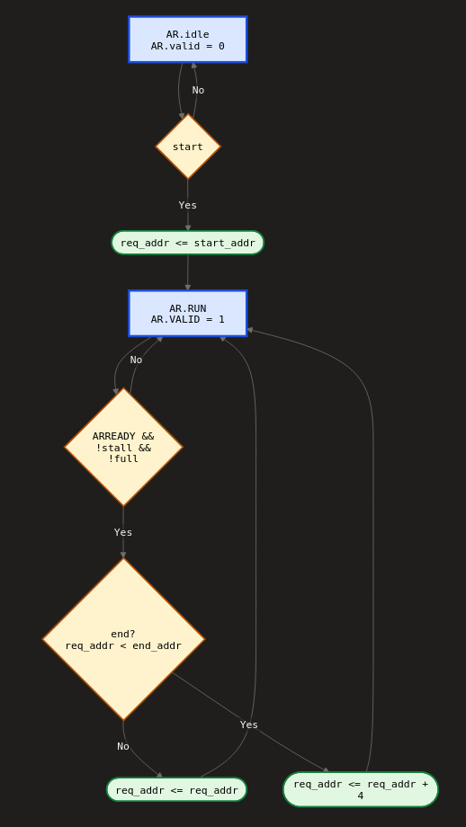
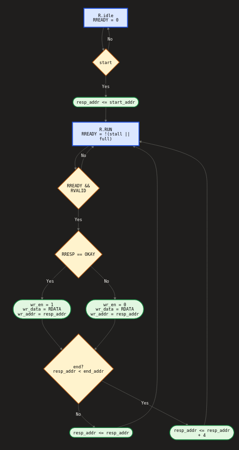
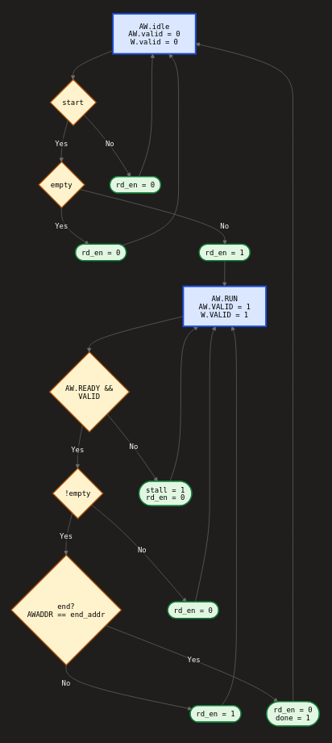
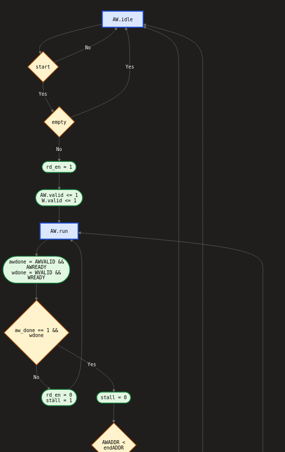
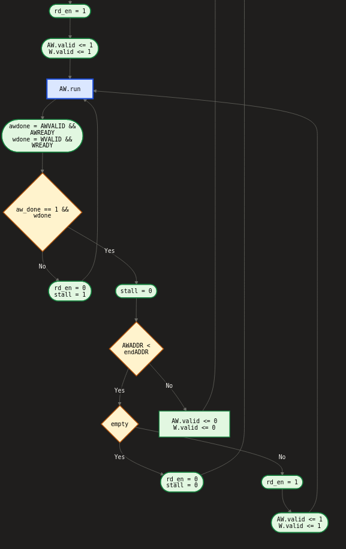
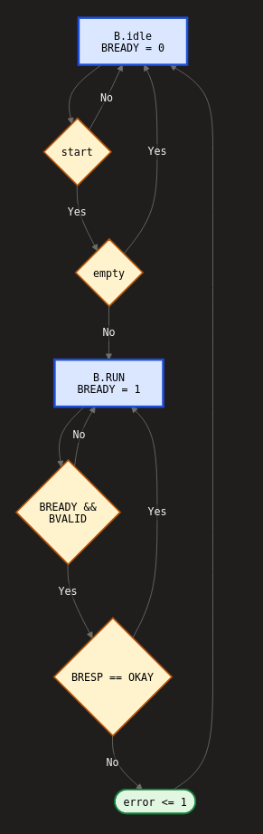

# aes128-axi-accelerator
**Architecture, memory mapping & slave memory design**

## Overview

A complete AES-128 encryption accelerator with AXI4-Lite interfaces, operating as a hardware slave peripheral accessible via standard register reads/writes. Internally it runs a 10-stage pipelined datapath that processes 128-bit plaintext blocks through all AES rounds, with dedicated memory controllers handling bulk plaintext reads and ciphertext writes. The design cleanly separates control (register interface), data transformation (crypto pipeline), and memory subsystem concerns into a reusable IP block.

## Architecture

| Domain | Role |
|---|---|
| **Control** | `controller_interface` decodes CPU-facing AXI4-Lite read/write transactions and forwards them to the controller, which holds the register file and generates start/stop signals plus config values (key, memory boundaries). |
| **Key expansion** | `key_scheduler` expands the 128-bit master key into eleven 128-bit round keys (`round_key_0`–`10`) via the AES key schedule with S-box lookups — computed combinationally, available to the datapath with zero latency. |
| **Memory** | Read controller streams plaintext words from `start_address`→`end_address` into the `read_mem` FIFO; write controller drains encrypted blocks from `write_mem` back to external memory. |
| **Encryption (datapath)** | 10-stage pipeline, one AES round per stage (SubBytes, ShiftRows, MixColumns, AddRoundKey); final stage omits MixColumns per spec. `valid_in`/`valid_out` handshake data in/out, allowing clean stalling. |

## Register Map (3-bit address, 32-bit registers)

| Register | Addr | R/W | Purpose |
|---|---|---|---|
| `CTRL` | `3'h0` | RW | Bit [0] = START. Write 1 to begin encryption. Only writable while `IDLE`; ignored during `BUSY`; auto-clears on completion. |
| `STATUS` | `3'h1` | RO | 0=IDLE, 1=BUSY, 2=ERROR, 3=DONE. Transitions automatically: `IDLE → BUSY → (DONE/ERROR) → IDLE`. |
| `START_ADDR` | `3'h2` | RW | 32-bit base address for plaintext reads. |
| `END_ADDR` | `3'h3` | RW | 32-bit exclusive end address for plaintext reads. |
| `KEY[0..3]` | `3'h4`–`3'h7` | RW | 128-bit key, little-endian words (`KEY[0]`=LSB…`KEY[3]`=MSB). Latched on START; safe to rewrite while `BUSY` (has no effect on the in-flight run). |

**Usage flow:** set `START_ADDR`/`END_ADDR` → load `KEY[0..3]` → write START in `CTRL` → poll `STATUS` until `DONE`/`ERROR` → read ciphertext back from the same addresses in external memory.
---
## State Machines

### Read Controller - AR_channel

### Read controller — R_channel

### Write controller — AW channel

### Write controller - W_channel - 1

### Write controller - W_channel - 2

### Write controller - B_channel - 3

---
## Memory Subsystem: Dual-FIFO Design

Two independent 4-entry circular FIFOs (dual-pointer, 3-bit pointers for wrap detection) decouple memory latency from encryption throughput. Empty = `read_ptr == write_ptr`; full = low 2 bits match but MSBs differ (wrap-around).

| | `read_mem` (input FIFO) | `write_mem` (output FIFO) |
|---|---|---|
| **Entry** | 64-bit: 32-bit addr + 32-bit data word | Same structure, ciphertext side |
| **Write side** | `read_controller` writes one 32-bit word/addr per beat; stalls reads when full | Pipeline writes a full 128-bit block + address at once (`valid_out`), filling all 4 entries; stalls pipeline when empty |
| **Read side** | Drains all 4 entries at once as a 128-bit block + address into the pipeline (`valid_in`) | `write_controller` reads one 32-bit word at a time via `rd_en`, enabling fine-grained AXI writes |

**Why asymmetric:** the pipeline needs 128-bit granularity; AXI4-Lite writes need 32-bit granularity. Read side drains in bulk, write side feeds incrementally.

**Global stall:** asserted by `write_controller` when either FIFO nears a critical state, synchronizing all domains:
- `read_mem` full → halts pipeline/key scheduler, giving the write side time to drain.
- `write_mem` empty/near-underflow → halts pipeline/read controller, avoiding deadlock (full read buffer, nowhere to put results).

## Data Flow

`CTRL` START → read controller issues AXI reads from `start_address`, filling `read_mem` word-by-word → once 4 words arrive, `read_mem` packs a 128-bit block + address and asserts `valid_in` → block flows through pipeline stages 0–10 (10 cycles, address/valid propagate alongside) → ciphertext + address land in `write_mem` (`valid_out`) → write controller drains one word at a time, issuing AXI writes to the matching address → on completion, `STATUS` → `DONE`.

## Encryption Pipeline

- **Stage 0** — `AddRoundKey` with `round_key_0` (initial whitening).
- **Stages 1–9** — Full round: `SubBytes` → `ShiftRows` → `MixColumns` → `AddRoundKey` (S-box as lookup table).
- **Stage 10** — Final round: `SubBytes` → `ShiftRows` → `AddRoundKey` with `round_key_10` (no `MixColumns`) → ciphertext out.
- **Latches** carry 128-bit data, 128-bit address, and valid bit through every stage; a global stall freezes all latches simultaneously to prevent corruption.
- Precomputed, combinational round keys mean no scheduling latency — one new block enters every 10 cycles.

## Memory Controllers (AXI4-Lite)

**Read controller** — two independent state machines for pipelined address/data phases:
- *AR (address)*: `ar_idle` → `ar_run` on START; issues `ARVALID` each cycle (if `ARREADY`, `read_mem` not full, not stalled); `req_addr += 4` per beat; returns to `ar_idle` at `req_addr >= end_address`.
- *R (data)*: `r_idle` → `r_run` on START; `RREADY` high when able; captures `RDATA` into `read_mem` on `RVALID`; returns to `r_idle` at `resp_addr >= end_address`.
- Decoupling lets address requests pipeline ahead of data — standard AXI4-Lite throughput trick. Only `OKAY` (`2'b00`) responses are accepted.

**Write controller** — single state machine:
- `aw_idle` → `aw_run` on START; reads one `write_mem` entry (`rd_en`) and raises `AWVALID`+`WVALID` together.
- In `aw_run`, waits for both address and data channels to complete (`aw_done && w_done`) before advancing; stalls the system if either channel isn't ready.
- Returns to `aw_idle` once `write_mem` is empty and `done` asserts. Monitors `BRESP`; any non-`OKAY` sets `STATUS = ERROR`.

## Performance

- **Latency:** 10 cycles, `valid_in` (stage 0) → `valid_out` (stage 10).
- **Throughput:** 1 block / 10 cycles = 0.1 blocks/cycle ≈ **12.8 Gbps** @ 400 MHz.
- **Stalls:** memory latency > 10 cycles eventually fills/empties a FIFO, throttling throughput to match memory bandwidth.
- **FIFO sizing:** 4 entries balances area vs. latency tolerance; larger FIFOs trade area for more slack.

## Design Trade-offs

| Decision | Trade-off |
|---|---|
| Precomputed round keys | +area (11×128-bit) for zero key-scheduling latency; on-the-fly generation suits tighter-area designs. |
| 10-stage unrolled pipeline | High area (10× round logic) for max throughput vs. an iterative single-stage design (~1/10 area, ~1/10 throughput). |
| Asymmetric dual FIFOs | Fine-grained AXI control at the cost of more complex FIFO logic vs. a simpler symmetric design. |
| Global stall signal | Simple, one signal, coarse-grained — sufficient for correctness vs. per-module back-pressure. |
| Sequential addressing | Simple contiguous read/write vs. flexible scatter/gather. |
| Synchronous control | Deterministic, verification-friendly vs. lower-latency async signaling. |

## Verification

10-vector NIST test suite (known plaintext/ciphertext pairs) exercising the full path from register writes through memory transactions, checking: correct ciphertext, `IDLE→BUSY→DONE` transitions, start/end address handling, FIFO full/empty edge cases, and error injection via `BRESP`.

Synthesizes cleanly to standard-cell libraries; round keys and S-box tables dominate area, pipeline stage logic depth dominates critical path timing.

## Key Takeaways

1. **Separation of concerns** — control, key management, datapath, and memory are independent modules.
2. **Pipelined throughput** — unrolled 10-stage pipeline + precomputed keys = one block per 10 cycles, no scheduling stalls.
3. **Smart buffering** — asymmetric dual-FIFO design balances area/latency/flexibility; global stall keeps flow control simple.
4. **Standard interfaces** — AXI4-Lite master + slave ports drop into any standard SoC flow.

---
